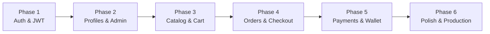

# Sovely E-Commerce Platform — Full Implementation Plan

## Project Audit Summary

### What Exists Today
| Layer | Status | Details |
|-------|--------|---------|
| **Mongoose Models** | ✅ Complete (14) | User, OtpToken, Customer, Category, Product, CustomerPricing, Wishlist, Cart, Order, Invoice, Payment, WalletTransaction, StockAdjustment, Counter |
| **Utilities** | ✅ Ready | [ApiError](file:///d:/JOSEPH%20VISHAL/OneDrive/Documents/MSRIT/Internship%20%28Sovely%29/E-commerce%20Website/src/utils/ApiError.js#1-22), [ApiResponse](file:///d:/JOSEPH%20VISHAL/OneDrive/Documents/MSRIT/Internship%20%28Sovely%29/E-commerce%20Website/src/utils/ApiResponse.js#1-9), [asyncHandler](file:///d:/JOSEPH%20VISHAL/OneDrive/Documents/MSRIT/Internship%20%28Sovely%29/E-commerce%20Website/src/utils/asyncHandler.js#1-6) — clean error handling foundation |
| **Express Setup** | ✅ Running | [app.js](file:///d:/JOSEPH%20VISHAL/OneDrive/Documents/MSRIT/Internship%20%28Sovely%29/E-commerce%20Website/src/app.js) with CORS, JSON, cookie-parser, helmet available. [index.js](file:///d:/JOSEPH%20VISHAL/OneDrive/Documents/MSRIT/Internship%20%28Sovely%29/E-commerce%20Website/src/index.js) with dotenv + nodemon |
| **Database** | ✅ Connected | MongoDB Atlas (`db_sovely`) via Mongoose |
| **Routes** | 🟡 Minimal | Only `/api/v1/health` exists |
| **Controllers** | ❌ Empty | `src/controllers/` is empty |
| **Middlewares** | ❌ Empty | `src/middlewares/` is empty |
| **Frontend** | ✅ Integrated | Full UI structure, React Router, Login/Signup Auth flows, Flip-card Services, and dynamic Product Pages |

### Recent Integrations (Landing_Page_Gagan Merge)
- **Landing Page Polish:** Completed responsive UI, category filtering, sticky sidebar, and active states for navigation.
- **Arya's Contributions:** Integrated the animated Flip-Card Services section and the expanded Footer with SVG payment icons (Visa, Mastercard, UPI, etc.).
- **Dev's Contributions:** Integrated React Router (`react-router-dom`) with fully functional Login, Signup, Forgot Password, and My Account pages routed through the main App component.
- **Tilak's Contributions:** Integrated the dynamic Product Description Page (`/product/:productId`) with the combined routing architecture.
- **Conflict Resolution:** Successfully merged 4-way branch conflicts keeping all UI/UX components intact while preserving complex routing rules.

### Skills Applied
| Skill | Applied To |
|-------|-----------|
| `nodejs-backend-patterns` | Express architecture, error handling, middleware structure |
| `frontend-design` | Luxury Minimal aesthetic, intentional typography, CSS variables |
| `react-best-practices` | Component structure, performance patterns |
| `api-security-best-practices` | Informs auth middleware, input validation, rate limiting |
| `api-patterns` | REST conventions, response formats, versioning |
| `error-handling-patterns` | Existing `ApiError`/`ApiResponse` classes |

---

## Phase 1: Authentication & Authorization ⬅️ START HERE
> **Why first?** Nothing else works without knowing who the user is.

### Backend
| File | Type | Description |
|------|------|-------------|
| `src/middlewares/auth.middleware.js` | NEW | JWT verification middleware + role-based `authorize('ADMIN')` guard |
| `src/controllers/auth.controller.js` | NEW | `register`, `login`, `verifyOtp`, `refreshToken`, `logout` |
| `src/routes/auth.routes.js` | NEW | Mount at `/api/v1/auth` |
| `src/app.js` | MODIFY | Import and mount auth routes, add global error handler middleware |

### Dependencies to Install
```
bcrypt jsonwebtoken
```

### Key Design Decisions
- JWT stored in httpOnly cookies (not localStorage) — per `api-security-best-practices`
- Access token (15min) + Refresh token (7d) pattern
- OTP flow uses the existing `OtpToken` model with its partial index constraint
- `asyncHandler` wraps all controller functions to catch errors cleanly

---

## Phase 2: Customer Profile & Admin CRUD
> **Why second?** After auth, users need profiles. Admins need to manage the catalog.

### Backend
| File | Type | Description |
|------|------|-------------|
| `src/controllers/customer.controller.js` | NEW | `getProfile`, `updateProfile`, `addAddress`, `removeAddress` |
| `src/routes/customer.routes.js` | NEW | Mount at `/api/v1/customers` (protected) |
| `src/controllers/admin.controller.js` | NEW | `createProduct`, `updateProduct`, `deleteProduct`, `adjustStock`, `createCategory` |
| `src/routes/admin.routes.js` | NEW | Mount at `/api/v1/admin` (admin-only) |

### Key Design Decisions
- Customer auto-creation on registration using `Counter.getNextSequenceValue('customerId')`
- Admin routes gated behind `authorize('ADMIN')` middleware
- Product CRUD validates `categoryId` existence before saving

---

## Phase 3: Catalog & Cart (Core Shopping Flow) ✅ COMPLETE
> **Why third?** This is the heart of the e-commerce experience.

### Backend
| File | Type | Description |
|------|------|-------------|
| `src/controllers/product.controller.js` | DONE | `getProducts` with recursive category hierarchy support |
| `src/controllers/category.controller.js`| DONE | `getCategories` filtered to root-level only |
| `src/routes/product.routes.js` | DONE | Mounting `/api/v1/products` and `/api/v1/categories` |

### Frontend (Phase 3 Refinements)
| Feature | Status | Description |
|---------|--------|-------------|
| **Skeleton Loading** | ✅ | Component-level localized loaders in `DropshipProducts.jsx` |
| **Dynamic Icons** | ✅ | Lucide-react SVGs mapped to DB categories via `categoryIcons.js` |
| **Navbar Integration** | ✅ | Dynamic category fetching and stable filtering links |
| **Hero Component** | ✅ | Shop Now scroll + brand-aligned hero image |
| **Wishlist Drawer** | ✅ | Animated, premium dark-mode sidebar synced with `WishlistContext`. Seamlessly handles "Move to Cart" and robustly extracts image metadata from DB structures |
| **Cart Drawer** | ✅ | Fixed structural image bleeding out from MongoDB subdocuments (`[object Object]` mapping error), making UI crisp and stable across Cart and Checkout |
| **Sidebar Auth** | ✅ | Integrated `AuthContext` to correctly render dynamic User Avatars and Log Out CTA instead of "Sign Up" wrappers |

### Key Design Decisions
- Product listing supports recursive category filtering (Parent -> Children lookup)
- Replaced global page-wipe Suspense with `@tanstack/react-query` `isLoading` skeletons
- Unified icon mapping system to ensure brand consistency between Navbar and Carousel
- Cart and Wishlist toggles connected to local UI state for instant feedback with graceful `[object Object]` to `.url` string extractions

---

## Phase 4: Advanced Invoicing & Checkout Flow (Current Focus)
> **Goal:** Support B2B functionality, flexible payment terms, and clear documentation.

### Backend
| File | Type | Description |
|------|------|-------------|
| `src/models/Invoice.js` & `Order.js` | MODIFY | Add `paymentTerms` (Enum: DUE_ON_RECEIPT, NET_15, NET_30) and `dueDate` calculation. Add `paymentMethod` "BANK_TRANSFER". |
| `src/controllers/order.controller.js` | NEW | `placeOrder`, `getMyOrders`, `getOrderById`, `cancelOrder` |
| `src/routes/order.routes.js` | NEW | Mount at `/api/v1/orders` (protected) |
| `src/controllers/invoice.controller.js` | NEW | `getInvoice`, `listMyInvoices`, `generateInvoicePDF` (using `pdfkit` or `pdf-lib`), and `markAsPaidManual` (Admins only) |
| `src/routes/invoice.routes.js` | NEW | Mount at `/api/v1/invoices` (protected) |

### Frontend
| File | Type | Description |
|------|------|-------------|
| `web-app/src/pages/Checkout.jsx` | NEW | Order summary, address, select payment terms (Net 15/30) and Bank Transfer instructions. |
| `web-app/src/pages/Orders.jsx` | NEW | Order history with status tracking and "Download PDF Invoice" button. |

### Key Design Decisions
- **PDF Generation**: Leverage the `pdf-official` / node `pdfkit` structures to generate professional invoices holding line items, taxes, branding, and bank transfer routing numbers.
- **Manual Payment Updates**: Crucial for Bank Transfers. An admin endpoint will transition invoice/order status from `pending` to `paid` once cash clears.

---

## Phase 5: Financial Layer (Payments & Wallet)
> **Goal:** Self-serve wallet management and integrated deposits utilizing Razorpay.

### Backend
| File | Type | Description |
|------|------|-------------|
| `src/controllers/payment.controller.js` | NEW | `createRazorpayOrder`, `verifyRazorpaySignature`, `webhookHandler` |
| `src/routes/payment.routes.js` | NEW | Mount at `/api/v1/payments` (protected) |
| `src/controllers/wallet.controller.js` | NEW | `getBalance`, `getTransactionHistory`, `addMoney` (generates Razorpay top-up intent) |
| `src/routes/wallet.routes.js` | NEW | Mount at `/api/v1/wallet` (protected) |

### Key Design Decisions
- **Razorpay Integration**: Use the official `razorpay` Node.js SDK. Implement `verifyRazorpaySignature` strictly for webhook events to ensure PCI compliance and prevent spoofing.
- **Add Money**: Generates a generic `WALLET_TOPUP` invoice against the current user, dropping into the standard Razorpay checkout flow. Once the raw webhook succeeds, we securely credit the `WalletTransaction` ledger.
- **Idempotency**: Follows `billing-automation` and `payment-integration` best practices. Razorpay's `order_id` map to MongoDB transaction references to prevent double-crediting.

---

## Phase 6: Polish & Production Readiness
> **Why last?** Optimize what already works.

### Backend
| Task | Description |
|------|-------------|
| Input validation | Add `express-validator` or `zod` schemas to all routes |
| Rate limiting | `express-rate-limit` on auth endpoints (per `api-security-best-practices` skill) |
| Helmet | Already installed — enable in `app.js` |
| Global error handler | Centralized middleware that catches `ApiError` instances |
| Logging | Add `morgan` or `pino` for request logging |
| `.env` cleanup | Add `JWT_SECRET`, `JWT_EXPIRY`, `REFRESH_TOKEN_SECRET` |

### Frontend
| Task | Description |
|------|-------------|
| Auth context | React Context for login state, token management |
| Protected routes | Redirect unauthenticated users to login |
| Loading states | Skeleton loaders per `react-ui-patterns` skill |
| Error boundaries | Catch rendering errors gracefully |
| Responsive design | Mobile-first breakpoints |

---

## Execution Order Diagram



## Verification Plan

Each phase will be verified before moving to the next:
- **Backend**: Test each endpoint via browser or curl
- **Frontend**: Visual verification in the browser
- **Integration**: Frontend successfully calls backend APIs
